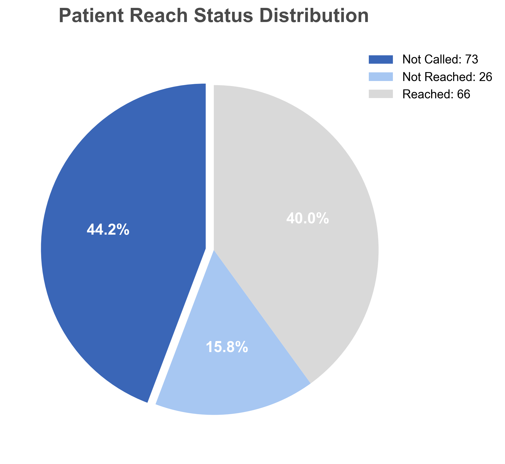
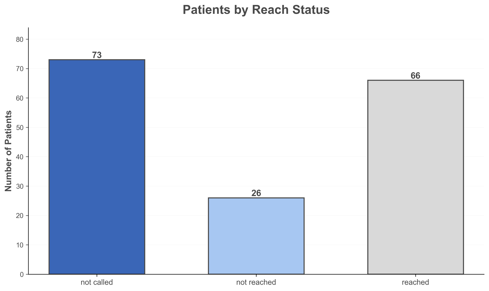
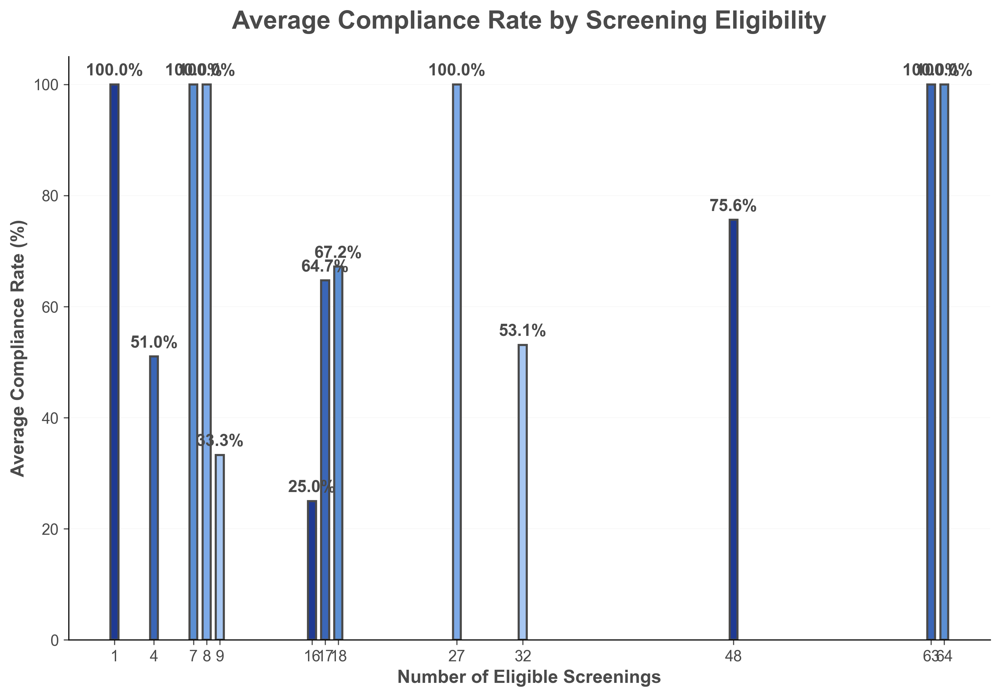
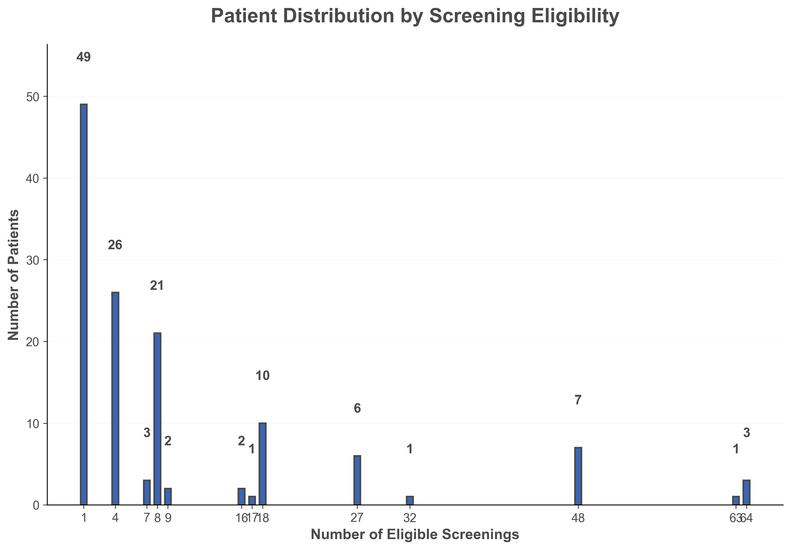
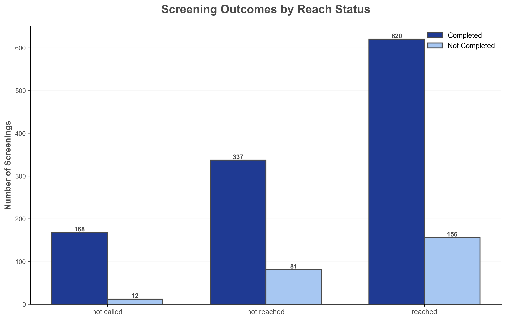
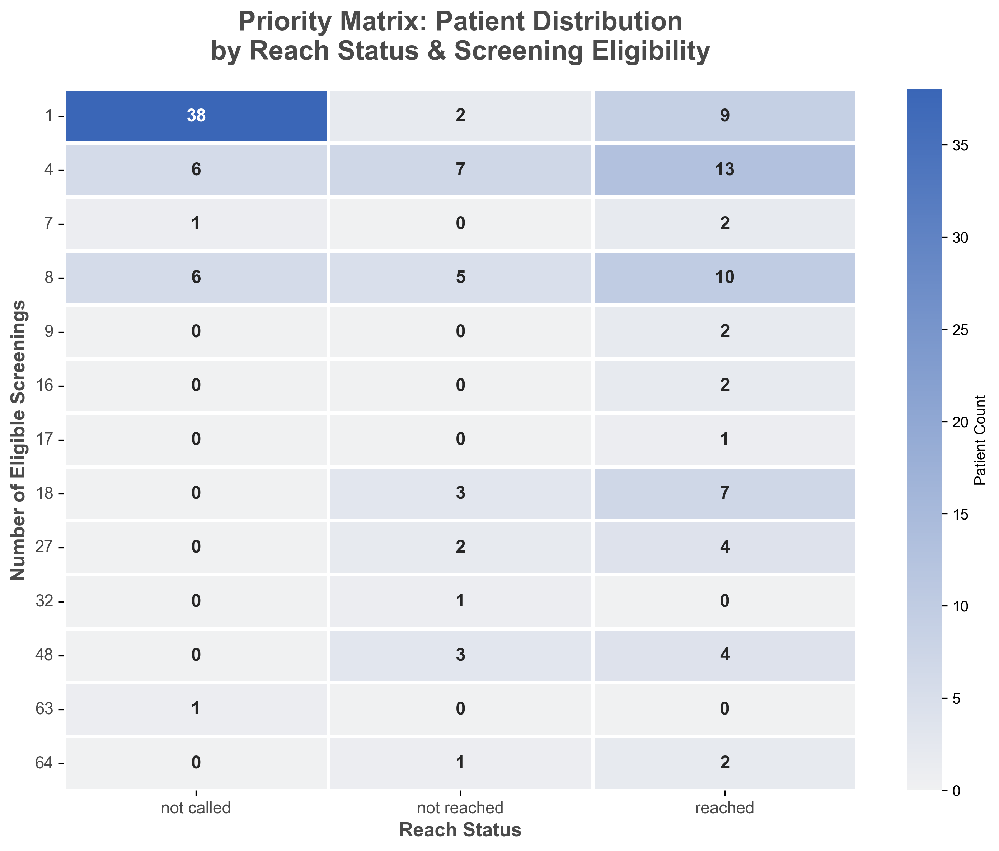
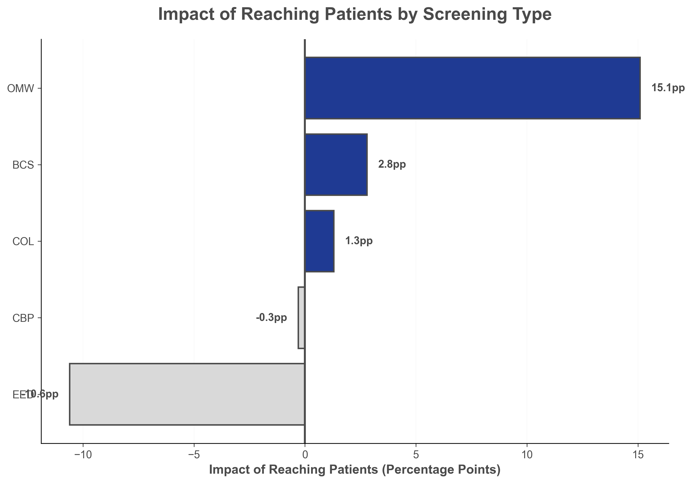

# Healthcare Screening Outreach Analysis
### Data-Driven Optimization of Preventive Care Compliance


---

## 📊 Executive Summary

This project analyzes the effectiveness of an **outbound call center campaign** designed to improve preventive healthcare screening compliance rates at Universal Healthy Humans Company (UHHC). Through comprehensive data analysis of **1,982 patient-screening records** spanning **165 unique patients**, the study examines intervention patterns and provides data-driven optimization strategies.

### 🎯 Key Findings

| Metric | Value | Impact |
|--------|-------|--------|
| **Patients Successfully Reached** | 66 of 165 | 40.0% of total population |
| **Success Rate Among Called Patients** | 71.7% | Contact effectiveness benchmark |
| **Expansion Opportunity** | 73 patients | Not yet called (44.2% of population) |
| **Compliance Maintenance** | ~80% | Consistent across reached/not reached |
| **High-Engagement Segment** | 180 screenings | 93.3% completion without intervention |

### 💡 Critical Insight: Selection Bias Identified

**Pattern Observed:**
```
Not Called Patients:   93.3% compliance
Not Reached Patients:  80.6% compliance
Reached Patients:      79.9% compliance
```

**Interpretation:**  
The "not called" group demonstrates **self-selection bias** - these patients are inherently more engaged with their healthcare and complete screenings proactively. The outreach campaign appropriately **targets lower-compliance patients**, maintaining ~80% completion rates among a more challenging population.

> **"The outbound calling strategy successfully maintains 80% compliance among patients who require intervention support, while identifying a highly-engaged segment (93.3%) that completes screenings independently."**

### 📈 Strategic Recommendations

**1. Segment-Based Strategy**
- ✅ **High-Engagement Segment** (93.3% compliance): Minimal intervention, automated reminders
- 🎯 **Target Segment** (~80% compliance): Continue outreach with optimized approach
- 📞 **Expansion Opportunity**: 73 uncalled patients require systematic outreach

**2. Operational Optimization**
- **Improve Reach Rate:** 71.7% → **85%+** through multi-touch strategy
- **Expand Coverage:** 56% → **95%** of eligible patient population
- **Resource Allocation:** Prioritize 92 patients (not reached + not called)

**3. Temporal Considerations**
- **Average Time to Screening:** 85.8 days post-call
- **Median Time:** 30 days
- **Implication:** Long-term follow-up and reminder systems needed

---

## 📁 Project Structure
```
healthcare-screening-outreach-analysis/
│
├── README.md                          # This file - Project overview
├── requirements.txt                   # Python dependencies
│
├── data/
│   ├── raw/                          # Original dataset (not tracked in Git)
│   ├── processed/                    # Cleaned data ready for analysis
│   │   └── cleaned_screening_data.csv
│   └── data_dictionary.md            # Detailed variable documentation
│
├── src/
│   ├── 01_data_cleaning.py           # Data validation & cleaning
│   ├── 02_q1_reach_analysis.py       # Q1: Patients reached analysis
│   ├── 03_q2_compliance_eligibility.py  # Q2: Compliance by eligibility
│   ├── 04_q3_impact_of_contact.py    # Q3: Intervention patterns
│   └── 05_q4_optimization_strategy.py   # Q4: Optimization recommendations
│
├── visualizations/
│   ├── q1_reach_analysis/            # Patient reach distribution
│   ├── q2_compliance_eligibility/    # Compliance patterns
│   ├── q3_impact_analysis/           # Intervention analysis
│   └── q4_optimization/              # Priority matrix & recommendations
│
└── docs/
    └── methodology.md                # Technical methodology & approach
```

---

## 🔍 Analysis Overview

### Business Context

**Universal Healthy Humans Company (UHHC)** operates an outbound call center staffed by nurses to support patients in completing required annual healthcare screenings. Each call (15-20 minutes) aims to:
- Explain screening importance
- Address patient concerns
- Help schedule appointments

**Target Screenings:**
- **BCS** - Bowel Cancer Screening
- **COL** - Colorectal Cancer
- **CBP** - Controlling High Blood Pressure
- **OMW** - Osteoporosis Management in Women
- **EED** - Early Elective Delivery Prevention

### Research Questions

This analysis addresses four critical business questions:

| # | Question | Key Insight |
|---|----------|-------------|
| **Q1** | How many patients were reached successfully? | 66 patients reached (40.0%); 71.7% success rate among called |
| **Q2** | Do compliance rates vary by screening eligibility? | YES - patterns vary, with highest compliance in single-screening patients |
| **Q3** | Does reaching patients improve compliance? | NUANCED - Self-selection bias present; ~80% compliance maintained among target group |
| **Q4** | How should we optimize outbound calls? | Segment-based strategy: differentiate high-engagement vs. target populations |

---

## 📈 Key Visualizations

### Q1: Patient Reach Status Distribution

<p align="center">
  
  
</p>

**Insight:** 66 patients reached successfully (40.0% of population). 71.7% success rate among contacted patients demonstrates effective calling operations. 73 patients (44.2%) remain uncalled, representing systematic expansion opportunity.

---

### Q2: Compliance by Screening Eligibility

<p align="center">
  
  
</p>

**Insight:** Compliance patterns vary by screening burden. Single-screening patients show highest completion rates (100% in eligibility group 1), while multi-screening patients face greater compliance challenges. Resource allocation should account for these differences.

---

### Q3: Impact of Patient Contact

<p align="center">
  
  
</p>

**Insight:** "Not called" patients show 93.3% compliance (self-selected high-engagement group). Reached and not reached patients maintain ~80% compliance, indicating the intervention targets and supports a more challenging population effectively.

---

### Q4: Optimization Strategy

<p align="center">
  
  
</p>

**Insight:** Priority matrix identifies patient segments by reach status and eligibility. Screening-specific analysis reveals BCS shows strongest performance among "not called" patients (96.9%), while EED shows lower completion rates among reached patients (73.7%), indicating screening-specific challenges.

---

## 🛠️ Technical Implementation

### Tech Stack

- **Python 3.11+** - Core programming language
- **Pandas 2.1.4** - Data manipulation and analysis
- **Matplotlib 3.8.2** - Static visualizations
- **Seaborn 0.13.0** - Statistical data visualization
- **NumPy 1.26.2** - Numerical computations

### Data Pipeline
```
Raw Data (1,988 records)
    ↓
Data Cleaning & Validation
    ↓
Cleaned Data (1,982 records | 165 patients)
    ↓
    ├── Q1: Reach Analysis (66 reached, 26 not reached, 73 not called)
    ├── Q2: Compliance by Eligibility (patterns across 1-64 screenings)
    ├── Q3: Intervention Analysis (93.3% vs ~80% compliance patterns)
    └── Q4: Optimization Strategy (segment prioritization)
        ↓
Business Insights & Recommendations
```

### Data Quality

**Cleaning & Validation:**
- ✅ Removed 6 invalid records (screening type 'A1C')
- ✅ Standardized boolean indicators to descriptive text
- ✅ Converted dates to datetime format (temporal analysis enabled)
- ✅ Enforced logical consistency (e.g., not_called → no call date)
- ✅ Validated all screening types against approved list

**Final Dataset:**
- **Records:** 1,982 (99.7% retention)
- **Unique Patients:** 165
- **Screenings per Patient:** Range 1-64 (median: 8)
- **Screening Types:** BCS (279), COL (588), CBP (269), EED (219), OMW (19)
- **Temporal Range:** Calls and screenings tracked with datetime precision

---

## 🚀 Quick Start

### Prerequisites
```bash
Python 3.11 or higher
pip (Python package manager)
```

### Installation

1. **Clone the repository**
```bash
   git clone https://github.com/YOUR_USERNAME/healthcare-screening-outreach-analysis.git
   cd healthcare-screening-outreach-analysis
```

2. **Create virtual environment**
```bash
   python3 -m venv venv
   source venv/bin/activate  # On Windows: venv\Scripts\activate
```

3. **Install dependencies**
```bash
   pip install -r requirements.txt
```

4. **Add your data**
```bash
   # Place your CSV file in data/raw/
   cp /path/to/your/DA_outbound_call_nursing_team.csv data/raw/
```

### Running the Analysis

Execute scripts in order:
```bash
# Step 1: Clean and validate data
cd src
python 01_data_cleaning.py

# Step 2: Run analyses (in any order after cleaning)
python 02_q1_reach_analysis.py
python 03_q2_compliance_eligibility.py
python 04_q3_impact_of_contact.py
python 05_q4_optimization_strategy.py
```

**Output:** Visualizations saved to `visualizations/` directory

---

## 📊 Methodology & Key Learnings

### Analysis Approach

1. **Data Preparation**
   - Rigorous validation against business specifications
   - Standardization of categorical variables
   - Temporal consistency verification

2. **Reach Effectiveness (Q1)**
   - Patient-level aggregation
   - Success rate calculation among contacted individuals
   - Coverage gap identification

3. **Eligibility Impact (Q2)**
   - Screening burden quantification
   - Compliance rate by patient segment
   - Volume distribution analysis

4. **Intervention Patterns (Q3)**
   - **Critical Discovery:** Self-selection bias identification
   - Comparative analysis across reach statuses
   - Recognition of inherent population differences

5. **Strategic Optimization (Q4)**
   - Segment-based prioritization framework
   - Screening-specific performance analysis
   - Resource allocation recommendations

### Analytical Honesty: Addressing Complexity

**Challenge Identified:**  
Initial hypothesis assumed direct causal relationship between outreach and compliance. Data revealed more nuanced reality:

- **Not Called:** 93.3% compliance (self-selected engaged patients)
- **Called (Reached/Not Reached):** ~80% compliance (intervention-requiring population)

**Resolution:**  
Recognized **selection bias** and reframed analysis to focus on:
1. Maintaining compliance in target population (~80%)
2. Expanding coverage to uncalled patients
3. Improving reach success rate (71.7% → 85%+)

**Learning:** Real-world data often challenges initial assumptions. Rigorous analysis reveals actionable insights even when patterns are unexpected.

For detailed methodology, see [docs/methodology.md](docs/methodology.md)

---

## 📈 Results & Recommendations

### Three-Tier Strategy

#### 1️⃣ **High-Engagement Tier (93.3% compliance)**
- **Population:** 73 patients currently "not called"
- **Strategy:** Minimal intervention
- **Action:** Automated digital reminders, annual check-ins
- **Resource:** 10% of call capacity

#### 2️⃣ **Active Support Tier (~80% compliance)**
- **Population:** 92 patients (66 reached + 26 not reached)
- **Strategy:** Sustained outreach and support
- **Action:**
  - Multi-touch calling (3-5 attempts)
  - Follow-up at 30, 60, 90 days post-call
  - Screening-specific education materials
- **Resource:** 70% of call capacity

#### 3️⃣ **Investigation Tier**
- **Population:** Patients with temporal or data inconsistencies
- **Strategy:** Root cause analysis
- **Action:**
  - Interview sample of patients
  - Identify barriers to completion
  - Test intervention refinements

### Expected Outcomes

**6-Month Targets:**
- 📞 Call coverage: 56% → **95%**
- ✅ Reach success rate: 71.7% → **85%+**
- 🎯 Maintain ~80% compliance in active support tier
- 📊 Establish baseline for high-engagement tier monitoring

### Success Metrics

- **Primary:** Overall screening completion rate
- **Secondary:** Reach rate among called patients
- **Tertiary:** Time to screening completion post-call
- **Qualitative:** Patient feedback on call experience

---

## 📚 Documentation

- **[Data Dictionary](data/data_dictionary.md)** - Complete variable documentation
- **[Methodology](docs/methodology.md)** - Technical approach, assumptions, and limitations

---

## 🎓 Skills Demonstrated

This project showcases:

- ✅ **Data Cleaning & Validation** - Rigorous quality assurance (99.7% retention)
- ✅ **Statistical Analysis** - Patient-level aggregation, segmentation, pattern recognition
- ✅ **Critical Thinking** - Identification and resolution of selection bias
- ✅ **Data Visualization** - Professional, publication-ready charts
- ✅ **Business Communication** - Translating technical findings to strategic recommendations
- ✅ **Python Proficiency** - Pandas, Matplotlib, Seaborn, NumPy
- ✅ **Healthcare Analytics** - Domain-specific understanding of preventive care
- ✅ **Analytical Honesty** - Transparent handling of unexpected patterns

---

## 👤 Author

**Isaac Cevallos**
- 💼 LinkedIn: https://www.linkedin.com/in/isaacbusiness/
- 🐱 GitHub: [@Isaaccev7](https://github.com/Isaaccev7)
- 📧 Email: isaac.cev.business@gmail.com

---

## 📝 License

This project is for portfolio demonstration purposes.

---

## 🙏 Acknowledgments

- Dataset provided as part of analytics case study
- Analysis conducted independently for portfolio development
- Inspired by real-world healthcare analytics challenges

---

**⭐ If you found this analysis insightful, please consider starring the repository!**

---

*Last Updated: January 2026*